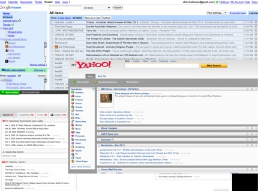

## Write great posts and articles

Writing for the web is a specialist skill and far too often you'll find people applying rules of other media when it comes to writing online articles or blog posts.

The main thing to remember is that text on the web is not published in one place but spreads throughout the web as bookmarks, links and references. Therefore it is very important to chunk texts up into easily digestible and repeatable chunks and make your headlines and document titles work without the context of the full text.

## Simple is not stupid

Writing very simple texts is hard work. Writing stupid texts is less hard. Consider the following traits of simple texts:

* Writing in simple terms takes a lot of work and thorough understanding of the subject matter. You need to be very familiar with the topic to be able to explain it in very easy terms.
* If you explain things in as easy as possible terms you make sure that you reach the largest amount of readers.
* Simple wording allows non-native speakers to get a chance to understand what the whole thing is about and maybe spend some time with a translation tool to make it work for them.

There is however a fine line between explaining complex things in simple terms and sounding condescending. Have someone else look over your texts to avoid this issue.

Read and re-read what you’ve written (take breaks in between) and make it easier in every iteration. Comparisons with real life objects work very well to simplify complex matters.

> **Example:** At the last Open Hack day of Yahoo I talked to several press people and they were thoroughly confused about the concept of a hack day and open APIs. I explained it this way: “If Yahoo were a car company our newest models would be here totally dismantled and we'd allow people to play with the parts. Maybe they'll find a cool new way to assemble them that is the breakthrough we wanted in making cars greener and more efficient.”

## Say what it is - don’t sugar-coat it

Your heading and introductory text are the most important things of a blog post. Both determine how easy it will be to find the post in the future.

Newspapers have conditioned us to write clever, witty and interesting headlines with pop references and alliterations. That is fun, but you already have bought the paper once you read them. Web headlines become links and bookmarks and need to make sense without the rest of the text. For a technical blog post state what the post is about – do not try to be too clever. Pop references are even worse as these don’t translate well to other cultures.

So do you want to be creative and witty for a minute or do you want to provide valid information for several months?

Blog posts should work like news items in radio:

* At the start of any post state what happened, where and how.
* Continue to explain what is coming in the post.
* Then go into details

This will prevent any confusion and put interested people on the way to find out more.

If you wonder where your blog headline needs to make an impact just think of RSS readers and personal homepages as shown in this screen shot: Example of various RSS readers showing blog titles

Each of these grey lines are a headline of an article or blog post and this is where it counts to be informative. Does your headline both tell the reader what is going on and entices them to click it?

## Size matters

Technical writing for online use is about keeping things short and to the point. People are busy and want the facts.

So in order to write great posts, write them, read them, delete what is not needed, read again, delete more and so on. If you cannot take anything away any longer, you’ve reached the point of publication.

If you have a lot to cover, why not split it up into several posts? This will allow you to tease at the end of the first post that the next will be published in a few days and give you repeat visitors and readers on your blog.

## Add media

If you can, add relevant media to the post. An introductory photo invites the eye and lures the brain into reading what happened. We’re lucky that these days embedding video, audio and slides is as easy as copy+paste.

Embedding ties our information together in a nice, easy to digest bundle. It also allows visitors to skim over the post the first time and come back to take in the rest (watch the video, download the podcast) later.

This also helps people who have a hard time reading but are very much capable of listening or seeing.

When embedding media make sure to also write explanatory text – images need good alternative text and videos at least a description of what they show.

> **Tip:**  Slides get much better by providing a text alternative or your notes. [SlideShare](http://slideshare.net) automatically creates text versions of your slides for you. Personally I start with my notes and then create my slide decks from them – that way I do always have an HTML version to link to from the deck.

## Structure your content

Structuring your content is very important. Giving readers landmarks to take in your information one chunk at a time allows them to skim the post before deciding to read it and as people are busy this goes down really well.

You achieve this by using a hierarchical heading structure. This will also help people with assistive technology like screen readers to jump from section to section quickly .If you add IDs to the headings people can bookmark parts of the document and send links to friends that will bring them directly to where they want to be.

Structuring a text also means using short sentences. It means paragraphs dealing with one thing at a time. It means using lists to explain step-by-step processes or give an overview of what is available. For large documents it also means providing a table of contents which allows people to jump directly to where they need to be.

## Time-stamp your content

If you eat food past the “best before” date you get sick. If you don’t time-stamp your publications they will be considered great forever – even if they are harmful by the technical standards of the future. They’ll be quoted – sometimes badly – and re-iterated over and over again and taken as gospel.

> **Example:** When I started as a web developer tables for layout were the only way to build a site. And you had to know a lot of tricks to make those work for Netscape 3 and IE4 and other fun browsers. I published a few articles on how to do that. Nowadays table layouts are counterproductive to web development and actually render much slower on modern browsers. If my articles didn't have a date on them maybe people would still consider them relevant. All the “CSS layout is too hard” posts out there surely hint at that.

Our technical environment moves at breakneck speed. What was “best practice” half a year ago might very well be “considered harmful” now. So let’s make sure that readers know when a certain document was written before following its advice even now.

## Cite to prove

Another very important point in this section is to cite other sources and link to content you have built upon. By citing other sources (and reading them of course) you validate your thoughts and facts. Readers don’t have to trust you blindly – they can make up their mind by comparison.

## Pre-emptive writing

One of the main things to remember is that as a developer evangelist you are the missing link between tech people and the outside world and tech people and your own company. This gives you a task that no other company department doing outreach can fulfil which I call **pre-emptive writing**.

What I mean by that is that when you talk about products you should not sell them. Instead your job is to make them interesting to developers out there and let them be the sales people for you. The main task there is to anticipate feedback you'd get if you did a plain old sales-pitch and answer that feedback before it happens - pre-emptive writing. In most cases this means one thing:

**Don't try to sugar-coat or hide the negative** - instead explain why it happens, what to do when it happens and how to report to the people whose job it is to fix the issue.

As developers we are a cynical bunch, battle-hardened by years of broken promises. An overly excited and positive description of any product is not going to make us think "I have to get me some of that" but is more likely to spark a "OK, where's the catch?".

This makes developers appear not the most social bunch and it can be incredibly frustrating for a marketing or PR person to do a classic sales pitch just be faced with a barrage of negative feedback. So your job is to predict part of that feedback and disarm the situation by acknowledging it in your writing. This can be a hard sell to your PR and marketing departments but you can explain it to them like this: by being open about the good and the bad you avoid a lot of confused or bad feedback that will be taken out of context by the press and cause the PR department a lot of work.

Negative feedback in a lot of cases falls into a few categories, all of which are commonly showing the writer in the light of an "internet troll".

> **Fact:** whilst some people are trolls and enjoy causing trouble or "fighting the system" with negative feedback, or trying to coax people into prolonging discussions unneccesarily, others do it involuntarily just by being disappointed just one time too many. It is a tough balance to keep. Real trolls should simply be ignored, or as the saying goes "don't feed the trolls". But people could have just posted too quickly or in anger and become an "accidental troll" as explained in my post [De-trolling the web](http://christianheilmann.com/2012/06/04/de-trolling-the-web-dont-post-in-anger) - don't post in anger. It can be tempting to just disregard negative feedback, but sometimes the wording hints at another issue that you can and should fix.

Here are a few categories of negative feedback and tips to pre-emptively avoid them:

* **This doesn't work at all for me - it is broken** - make sure to define very obviously what environment is needed to run the product or demo you talk about.
* **This is the same as product x by company y** - a lot of times this is a fanboy of a competitor speaking. Mention that your product is very similar to others and list them. Explain in detail what the differences are and that your product is more than just a copy. By showing that you know about the other products you prove that you did do your homework and still found it worth-while to talk about it. Do not let people catch you not having done your research.
* **Great but I can never use that, nobody needs that** - explain in detail what problem the product solves and if this is not a very common problem now but one of the future ask for feedback on how people like the product. Also tell them that this is a chance to make sure the product will be ready and great once they encounter that issue.
* **Why do you waste time on this when your product y is still broken?** - make sure your writing sets the scope for the article. Talk in detail about the one product. If you are lucky, other people will answer to a comment like this that it is out of place. If not, answer swiftly that it is and point at a different thread or discussion where that person can vent their unhappiness about the other product.
* **I like this but I don't have time to test this** - prepare demos and code examples with simple feedback mechanisms for people to try out with a simple click - maybe even offer a simple survey.

This is just a few examples of what can be done to pre-emptively avoid bad feedback using full disclosure. There are many more but I am sure you will find good ways to deal with the issue.
